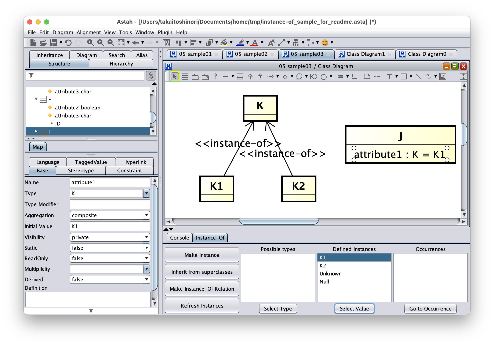

astah* Instance-Of Plugin
===============================

Version
----------------
1.1

Available for
----------------
astah* Professional, UML

Description
----------------
This is a plugin for supporting so-called "instance-of" relations among classes or blocks, which represent the one side is an instance of the other one.  The functions of the plugin include the followings. 
- Support for drawing Instance-Of relations
- Support for describing instances based on the defined Instance-Of relations
- Support for setting initial values for attributes with the information on defined instances 
- Support for understanding occurrences of a given class as initial values

Background
----------------
Let us consider the following three concepts: (1) Model of industrial product (2) Porsche911，(3) Porsche911 owned by Alice. Here, 
(2) is an instance of  (1)  and (3) is an instance of (2).  In this case, if we represent (2) as an object in the context of UML,  it is difficult to represent that (3) is an instance of (2).

In such a situation, "Instance-Of" relation can be useful since it can explicitly represent that one side is an instance of the other side.  Using "Instance-Of" relations, the relations among the three concepts above can be represented as follows.

How to Install
----------------

0. Download .jar file from
   https://github.com/ChangeVision/astah-instanceof-plugin/releases/download/v1.1/instanceof-1.1.jar
1. Launch Astah and drag the downloaded .jar file to an open instance of Astah. A pop-up will appear asking you to confirm installation, choose [Yes].
2. If the pop-up opens, restart Astah and open any project.
3. Now you will have [Instance-Of] Tab in the Extension View below the Diagram Editor.

How to use
----------------
### Transform existing relations to "Instance-Of"
First, assume you want to make an "Instance-Of" relation for the following association relation.

Here, select the association relation and then push "Make Instance-Of Relation" button.

Then, you can see ≪instance-of≫ stereotype is added to the selected association relation.  This relation is interpreted as "A is an instance of B"

You can add ≪instance-of≫ stereotype for two or more association relations by selecting those relations at the same time.
Several notations for "Instance-Of" relation can be found in literature, e.g., using dependency relation, association relation with a name, etc.  In this plugin tool, we use a notation by an association relation with a stereotype as shown above.

### Transform an existing class to an instance based on defined "Instance-Of" relations

If two model elements are linked with an "Instance-Of" relation, the source element (i.e. an instance) can inherit the attributes defined in the target element (i.e. the type of the instance). Let us consider the following model.

Here, select the class A and push "Make Instance" button.  As you can see, the attributes defined in the target class B are introduced to the selected class A.

As in this case the initial values are also inherited if it is defined in the target class.

### Inherit attributes based on generalization relations

Although this is not a function directly supporting "Instance-Of" relations, it is often useful in modeling activities with "Instance-Of" relations.  Based on generalization relations among classes, attributes can easily be introduced.  For example, in the following model, in general the class D is interpreted as it has also attribute2 and attribute3 since the superclass C does and thus we do not need to explicitly add those attributes.

This plugin takes account into the generalization relations of the definition class.  Assume a class E is introduced to be an instance of $D$ as follows.

In this model, the plugin interprets D is a subclass of C and thus introduces attribute2 and attribute 3 for E.

In such a situation, sometimes the class C has more specific information than the super class C.  For example, a user may characterise the class D by defining the value of the attribute2 can be determined. To represent such a characteristics, attributes of the class D need to be explicitly mentioned on a diagram.  Assume the value of attribute2 of D is determined as false.  Then, a user can user "Inherit from superclass". For the model mentioned above, 

select D and push "Inherit from superclass" button.

The attributes of C are inherited to D.  If you define an initial value of an attribute of D and introduce a new class E with "Instance-Of" relation, then using "Make Instance" function, the inherited attribute2 has the initial value defined for D. 

### Use defined instances

If instances are defined for some class, it is naturally to expect that we can use those instances as values for attributes that has a type defined by that class.  Let us consider the following definition.

Then the defined class K is used as a type of attribute1 of another class J.

In this model, we can see K has values at least K1 and K2.  Select the attribute1 in J.

You can see in the Instance-Of view, the text area titled "Defined instances" contains the names"K1" and "K2" of the defined instances with the default items "Unknown" and "Null".
Try to select "K1" and push "Select Value" button.

You will see that attribute1 is substituted with K1 as an initial value. 
The values Unknown and Null are always included so that for any type those values can be used.

Remark the following points.

- If "Attribute Initial Value" in the setting of the initial visibility is not set to ON, then the initial values do not appear in diagrams.
  
  Even if the setting is off, initial values can be checked through the property view.
- Each initial value of an attribute is a string and thus a value set with this function is just a string of a name of the selected class.  Therefore, changing the name of the class K1 does not affect to the values set by this function.  
- If modifying the model does not affect to the list of instances in "Defined instances" window, try to push "Refresh Instances" button.  Then you will see the list will be updated.

### Support for detailing attribute types
Assume the following model.

In this situation, pushing the "Make Instance" button to the class y brings introducing attributes to y as follows.

In such a situation, sometimes a user want to restrict the type of attribute1 than the type X that is defined in the superclass P.
To support those intentions, this plugin provides a function to easily set a type of attribute based on the defined generalization hierarchy.  Select the attribute attribute1 of y.

You will see Y and Z that are defined as subclasses of X are listed up in the "Possible types" window.  For example, select Z and push "Select Type" button.

# To understand occurrences of a given class as initial values

Once modeling with this tool has progressed to a certain degree, you may want to know for a given class, the classes having an attribute with an initial value corresponding to the given class.  Let us consider the following situation.  Assume the class J is located in some another diagram to K1, then it is hard to understand the usage of K1 only from the view of the diagram containing K1.

In such a case, try to select K1 in the diagram.

Here, you will see a list of classes that have attributes with initial value K1. Then select J from in the "occurrence" window and push "Go to Occurrence" button.

Although in this example both K1 and J are placed in the same diagram, in the situation that those classes are in different diagrams, first a diagram containing J is opened, then J is displayed at the center position.  

Using the function mentioned above, for a given class, you can easily catch up the set of classes that use the given class as an initial value of an attribute.

# Example model

For more practical examples, see the sample folder.

license
---------------
copyright 2021 change vision, inc.

licensed under the apache license, version 2.0 (the "license");
you may not use this work except in compliance with the license.
you may obtain a copy of the license in the license file, or at:

<http://www.apache.org/licenses/license-2.0>

unless required by applicable law or agreed to in writing, software
distributed under the license is distributed on an "as is" basis,
without warranties or conditions of any kind, either express or implied.
see the license for the specific language governing permissions and
limitations under the license.
