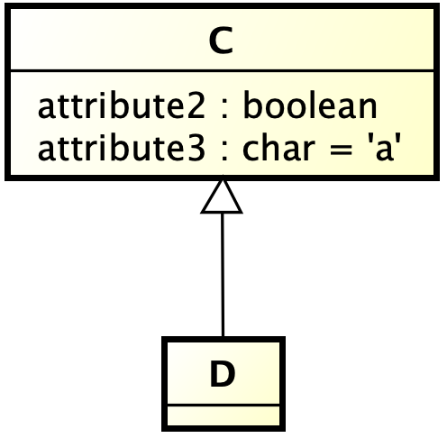
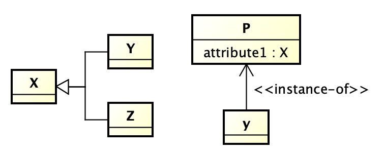

astah* Instance-Of プラグイン
===============================

Version
----------------
1.0

Available for
----------------
astah* Professional, UML

Description
----------------
クラスやブロック間の関係の一つで，一つのクラスのインスタンスであることを表すInstance-Of関係に対する支援する機能を集めたプラグインです。主な機能は次の通りです。
- Instance-Of関係の作成支援
- Instance-Of関係に基づくインスタンス作成支援
- 定義したインスタンスを利用した属性の初期値の設定支援

Background
----------------
例えば，(1) 工業製品型式，(2) ポルシェ911，(3) Aさんのポルシェ911，というものがあったときに，
(2) は (1) のインスタンスであり，(3)は(2)のインスタンスと考えられます。このような場合に，(2)のインスタンスをオブジェクトとして表現してしまうと，(3)が表現できなくなってしまいます。

このようなときに，Instance-Ofという関係を導入することにより，明示的に一方が他方のインスタンスであることを示すことにより，上記三つの間の関係を表現することが考えられます。

How to Install
----------------

0. 以下から .jarファイルをダウンロードしてください。
   https://github.com/ChangeVision/astah-instanceof-plugin/releases/download/v1.0/instanceof-1.0-SNAPSHOT.jar
1. 上部メニュー[ヘルプ] – [プラグイン一覧] からプラグイン一覧を開きます。
2. [インストール] ボタンをクリックし、jarファイルを選択してインストールしてください。
3. astah* を再起動し、プロジェクトを開きます。
4. 下部の拡張ビューに[Instance-Of] タブが追加されます。

使い方
----------------
### 既存関係のInstance-Ofへの変換
はじめに，Instance-Of関係にしたい関係を次のように作成したとします。

ここで，関連関係を選択した状態で，「Make Instance-Of Relation」ボタンを押してみます。

すると，選択した関係に ≪instance-of≫ ステレオタイプが付加されていることが確認できると思います。これは，「AはBのインスタンスである」と読みます。

関連関係を複数選択してもまとめて付加されます。Instance-Of関係の表現は，依存関係を使う場合や，関連関係の名前で示す場合など，文献によって様々な方法が見られますが，ここでは，上記のような，片方の誘導可能性が定義された関連関係に対するステレオタイプによる表現を仮定します。

### Instance-Of関係を利用した既存クラスのインスタンスへの変換

Instance-Of関係が定義されていた場合，定義側のクラスで定義されていた属性を引き継ぐことができます。次のようなモデルを仮定します。

ここで，クラスAを選択した状態で「Make Instance」ボタンを押してみましょう。つぎのようにInstance-Of関係の定義に従って，定義するクラスであるBの属性がAに引き継がれたのが分かると思います。

また例で示したとおり，属性に初期値が定義されている場合はそれも引き継ぎます。

### 汎化関係に基づく属性の引き継ぎ

これは，直接Instance-Of関係を支援するものではありませんが，Instance-Of関係を用いたモデリングでよく使う機能です。汎化関係に基づいて，属性を引き継ぎます。次のような汎化関係が定義されていたとき，Dにも属性attribute2やattribute3が存在していると解釈しますので，一般的には，あえてDの方に属性を記述する必要はありません。

例えば，このプラグインでも汎化関係にあるクラスの情報も反映してInstance-Of関係を持つモデルの記述を支援します。新しくクラスEを追加し，次のようなInstance-Of関係を追加したとします。。

このような場合での前述の「Make Instance」ボタンを押すと，汎化関係にあるCの属性をもつインスタンスを作成してくれます。

ただ，ここで，クラスDは，Cから引き継いだ属性attribute2は，初期値としてfalseであるという特徴をもっていたと仮定します。そのような状況を記述したい場合には，やはり継承クラスの方にも属性を書きたいと思います。そのようなときに，「Inherit from superclass」ボタンを使ってください。前述の，

の状況でDを選択した状態で「Inherit from superclass」ボタンを押してみてください。

属性が継承できます。ここで，例えば，Dのattribute2には初期値falseを定義し，さきほどのどのように，DとInstance-Of関係を持つEを導入し，「Make Instance」ボタンを押せば，EにはDにおいて定義した初期値をもつ属性が導入されます。

### 定義したインスタンスの利用

あるクラスのインスタンスを定義しておけば，それらを属性の値として利用することが期待できます。
例えば，次のように定義していたとします。

ここで，他のクラスの属性のタイプとしてKが利用されたとします。

このモデルにおいては，Kの値として，少なくともK1とK2が存在していることが分かります。それでは属性attribute1を選択してみましょう。

Instance-OfタブのDefined instancesと書かれたところに，UnknownとNullとともに，定義したK1とK2の値が表示されているのが確認できます。そこで，例えば，K1を選択し，「Select Value」ボタンを押してみてください。

attribute1 に初期値としてK1が設定されたと思います。Unknown及びNullはどのような型の属性に対しても使用できる値として予め候補に含まれています。

以下注意点です。

- ここで，システムプロパティにおいて，属性の初期値の表示状態がONになっていない場合は，図上には表示されません。
  
  その場合でも，プロパティビューから初期値が設定されていることが確認できます。
- 初期値に設定できるのは文字列だけであり，この機能でも，インスタンスとして定義されたクラスの名前を設定しているだけです。従って，例えば，モデル上のクラスK1の名前を変えても，設定した初期値の名前は変わりません。
- モデルを編集した直後では，このリストにインスタンスの情報が反映されていない場合もあるかも知れません。その場合は，「Refresh Instances」ボタンを押すことによって反映されます。

### 属性の型の詳細化支援
次のようなモデルがあったとします。

ここで，yに対して「Make Instance」ボタンを押すと次のようになります。

さて，このような状況でよくあるのが，クラスPの属性attribute1の型はXとして定義しているが，そのインスタンスであるyの属性attribute1については，より限定した型である場合があります。そこで，yの属性attribute1の型を簡単に制限する機能が本プラグインで提供されます。yの属性attribute1を選択してみてください。

「Possible types」というところに，もともとのattribute1の型であるXのサブクラスとして定義されているYとZがリストアップされています。例えば，Zを選んで「Select Type」ボタンを押してください。

# モデル例

sampleフォルダにサンプルがありますので参照してみてください。

license
---------------
copyright 2021 change vision, inc.

licensed under the apache license, version 2.0 (the "license");
you may not use this work except in compliance with the license.
you may obtain a copy of the license in the license file, or at:

<http://www.apache.org/licenses/license-2.0>

unless required by applicable law or agreed to in writing, software
distributed under the license is distributed on an "as is" basis,
without warranties or conditions of any kind, either express or implied.
see the license for the specific language governing permissions and
limitations under the license.
